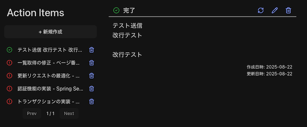

# TodoApp: React + TypeScript Sample

React + TypeScriptによるシンプルなTo-do管理フロントエンド  
ETagの楽観的ロックとページング機能に対応するREST APIと連携



## 技術スタック

| ライブラリ / ツール | バージョン |
|---------------------|------------|
| Vite                | 7.1.2      |
| React               | 19.1.1     |
| React DOM           | 19.1.1     |
| Lucide React        | 0.539.0    |
| SWR                 | 2.3.6      |
| Axios               | 1.11.0     |
| Sass                | 1.90.0     |
| TypeScript          | 5.8.3      |
| Zod                 | 4.0.17     |

## 動作環境

- Node.js >= v24.6
- npm >= v11.5
- macOS / Raspberry Pi OS Lite (64bit)

## フォルダ構成

```text
src
├── features
│   ├── api
│   │   ├── guards
│   │   ├── schemas
│   │   ├── types
│   │   └── utils
│   ├── todo
│   │   ├── components
│   │   ├── hooks
│   │   ├── types
│   │   └── utils
│   └── view-mode
│       ├── guards
│       ├── hooks
│       ├── schemas
│       ├── types
│       └── utils
├── shared
│   ├── constants
│   ├── hooks
│   └── utils
├── styles
├── App.tsx
└── main.ts
```

## 注意事項

- 本プロジェクトは学習を目的とした個人開発です。
- 実運用を前提とする場合には、十分な設計・検証を行なってください。
